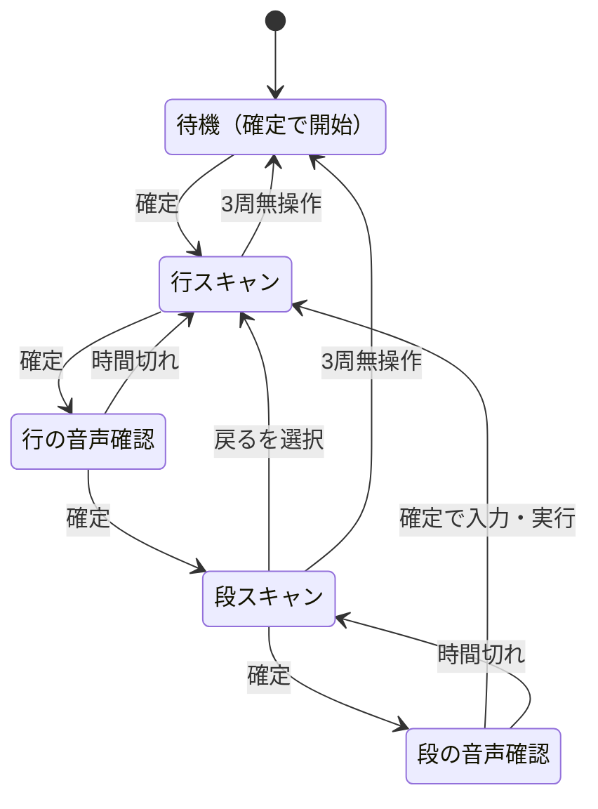

# スキャン入力方式 仕様

- 状態: 実装済み（iPad 実機での確認待ち）
- 起票: 2026-09-29

## 背景

手の震えが強くなり、方向キーで目的の行・段までカーソルを正確に動かすことが難しくなってきた。狙った位置を押す操作をなくし、「確定ボタンを押すタイミング」だけで入力できる方式（オートスキャン）を追加する。

従来の方向キー方式は、症状が比較的軽い方のために残す。1つのアプリの中で、設定の「入力方式」で切り替える（別アプリにはしない）。

## 要件（2026-09-29 受領）

1. 行パネルの候補「あ」「か」「さ」…を「あ」から順に、1項目ずつ一定時間（既定2秒、設定で変更可）強調表示（フラッシュ）する
2. 目的の行がフラッシュしている間に確定ボタンを押すと、その行を選択する
3. 行を選択すると、段パネルにその行の文字（例: か行なら「か」「き」「く」「け」「こ」）が表示され、「か」から順に同じようにフラッシュする
4. 目的の段がフラッシュしている間に確定ボタンを押すと、その文字を選択する
5. 行・段とも、最後の候補のフラッシュが終わるまでに確定ボタンが押されなければ、最初の候補に戻って繰り返す
6. 行・段を選択したら、音声で確認する（行:「か行ですね？」／段:「くですね？」）
7. 確認後、確認待ち時間（既定2秒）内に確定ボタンを押すと選択が決まる。段の場合は、決まった文字を上段の入力表示欄に追加する
8. 時間内に押されなければ選択を取り消し、フラッシュを再開する

## 動作の流れ



## 候補の並び

行パネル（5列、光る順と並び順を一致させる）:

```
あ    か    さ    た    な
は    ま    や    ら    わ
゛゜小 記号  機能
```

段パネル（横一列。最後に必ず「戻る」が付く）:

| 行 | 候補 |
|---|---|
| あ〜ら行（や行を除く） | 5文字（例: か き く け こ） |
| や行 | や ゆ よ |
| わ行 | わ を ん ー |
| ゛゜小 | 直前の1文字の変換候補のうち、変換できるもの（濁点・半濁点・小文字の順） |
| 記号 | 、 。 ？ |
| 機能 | 読み上げ 削除 空白 クリア |

## 決定事項

| No. | 論点 | 決定 |
|---|---|---|
| Q1 | 方向キー方式の扱い | 残す。設定の「入力方式」で方向キー／スキャンを切り替える。方向キー方式の画面と操作は従来のまま |
| Q2 | 操作ボタンの扱い | 行スキャンの末尾に「機能」を置き、機能パネル（読み上げ／削除／空白／クリア／戻る）をスキャンする。スキャン画面には直接押す操作ボタンを置かない。設定ボタンは上部に残す |
| Q3 | パネルの並び | 段パネルは横一列。行パネルは「゛゜小」を「わ」の後ろに置く |
| Q4 | や行・わ行・記号 | や行「や ゆ よ」、わ行「わ を ん ー」。句読点「、」「。」「？」を「記号」行として追加 |
| Q5 | 確認音声の文言 | 行「か行、ですね？」、段「く、ですね？」。゛゜小は「変換」、記号は「記号」、機能は「機能」と読む |
| Q6 | 確認待ちの数え始め | 音声の読み上げが終わってから数える。読み上げ中の押下は受け付けない |
| Q7 | 時間切れ後の再開位置 | 取り消した項目の1つ前から再開する（回答がなかったため推奨案を採用） |
| Q8 | 確定ボタンの大きさ | スキャン画面の下部全体を1つの確定ボタンにする（回答がなかったため推奨案を採用） |

確認音声では、単独の1文字が聞き取りやすいよう「、」で間を入れる。1文字では読まれない・聞き取りにくい文字は次のように読む: ー→のばし棒、、→読点、。→句点、？→はてな、小文字→「小さい あ」など。

## 実装した提案

| No. | 内容 |
|---|---|
| P1 | 点滅させず、光っている間は太枠＋背景色で強調し、下端のバーで残り時間を示す。音声確認中は塗りつぶしで示し、確認待ちの残り時間をバーで示す |
| P2 | 確定ボタンは指が触れた瞬間（pointerdown）に反応させる |
| P3 | 押した後の連打防止時間（既定0.5秒）内の押下は無視する |
| P4 | 起動直後は待機状態で、最初の確定でスキャンを始める。設定画面を開いたとき、アプリが裏に回ったときは待機状態に戻る |
| P5 | 段パネルの末尾に「戻る」を置く。選ぶと、選んでいた行の1つ前から行スキャンを再開する |
| P6 | 3周（設定可）続けて押されなければ待機状態にし、「確定で再開」と表示する |
| P7 | 外部スイッチ（キーボードとして Space／Enter を送るタイプ）でも確定できる |

## パネルの直接タッチ（2026-09-29 追加）

スキャン入力は介助者と一緒に使うため、光るのを待たずにパネルをタッチして選べるようにする。末尾にある「機能」（クリア・削除など）へすぐ行けるようにするのが主な目的。

- 行パネルをタッチすると、音声確認なしでその行の段スキャンに進む
- 段パネルをタッチすると、その項目の音声確認に進み、確定ボタンで決まる。本人が震えで誤って触れても、確認を待てば取り消されるため被害が出ない
- 段パネルのタッチは段スキャン中だけ受け付ける（行スキャン中のプレビューは光る行に合わせて変わるため、狙いと違う文字を選ぶおそれがある）
- タッチは click で受ける（指が動いたタッチは反応しないため、誤タッチを減らせる）。連打防止時間は確定ボタンと共通
- 設定の「パネルのタッチ」で無効にできる（本人が一人で使う場合）

段パネルの機能名（読み上げ・削除・空白・クリア・戻る）は、5列でも「クリア」が1行に収まる大きさで表示し、「読み上げ」は「読み／上げ」の2行にする。

## その他の動作

行スキャン中は光っている行の候補を段パネルに薄くプレビュー表示する。゛゜小を選んだとき、直前の文字に変換候補がなければ「変換できる文字がありません」と読み上げてスキャンを続ける。

## 設定項目

| 項目 | 選択肢 | 既定値 |
|---|---|---|
| 入力方式 | 方向キー／スキャン | 方向キー（更新後も利用中の画面が急に変わらないように） |
| スキャン間隔 | 1.0〜4.0秒（0.5秒刻み） | 2.0秒 |
| 確認待ち時間 | 1.0〜5.0秒（0.5秒刻み） | 2.0秒 |
| 連打防止 | 0.3／0.5／0.7／1.0秒 | 0.5秒 |
| 無操作で停止 | 2〜5周／しない | 3周 |
| パネルのタッチ | 有効／無効 | 有効 |

スキャン用の項目は、入力方式がスキャンのときだけ表示する。

## 所要時間の目安

スキャン間隔2秒、確認待ち2秒の場合、1文字あたり平均15〜20秒程度かかる。

| 段階 | 目安 |
|---|---|
| 行を選ぶ | 約10秒（13項目の前半〜中ほどで押す場合） |
| 行の確認 | 約2秒 |
| 段を選ぶ | 約5秒 |
| 段の確認 | 約2秒 |

## 今後の候補

- 行・段それぞれの音声確認を OFF にする設定（慣れた後に1文字あたり約2秒短縮できる）
- 「！」など記号の追加
